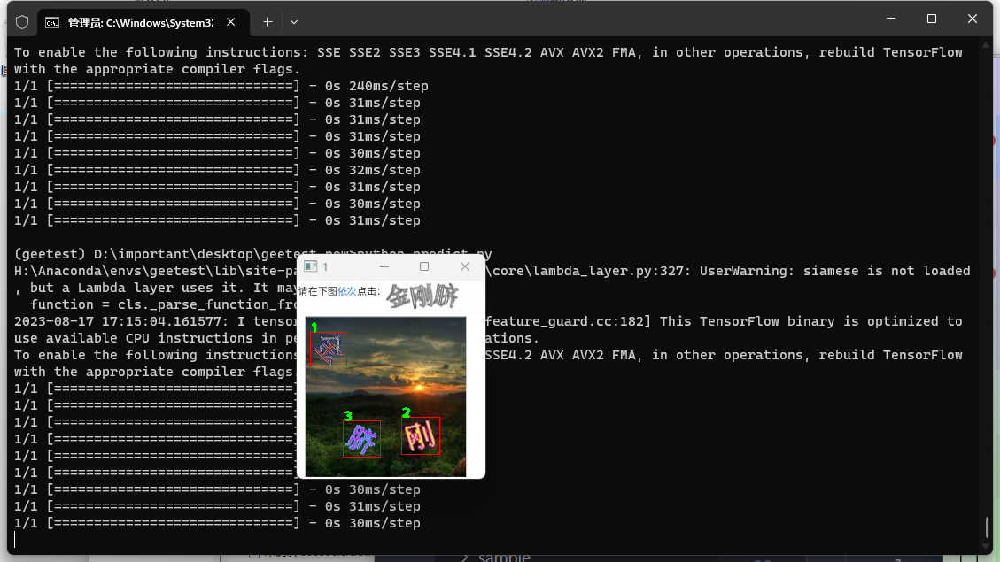

# 点选
基于孪生神经网络实现的点选识别

## 温馨提示
该项目仅供学习研究改进点选验证码的安全性，请勿用于商用或其他带有攻击性质的业务场景中！！！


## 效果
4090训练100轮 测试集可以达到98.6%以上，基本上已经破解了该类验证码。

### 如何使用？
下载数据集和预训练模型：https://systems.lanzout.com/iWUqz15mo57a

#### 环境安装
安装环境，我用到的是python3.10
```
conda create -n geetest python=3.10
```

安装必要的环境
```
pip3 install -r requirement.txt
```

#### 数据准备
准备数据集，放入data中，格式为 id_序号.jpg|png，id可以采用uuid，序号第一张图是1，第二张图是2，只能两张图

例如，相同的两个字，  ``xxxxx_1.jpg``和``xxxxx_2.jpg``

### 训练模型
配置训练参数,config.py中，一般来说只需要配置gpu就行了，如果你没有gpu就不填，就自动使用cpu

开始训练
```
python train.py
```

预测
```
python predict.py
```

## 最后
邮箱：wlkjyy@vip.qq.com

# 希望各位大佬打赏点，前期找人标注花了不少的资金！！！！


